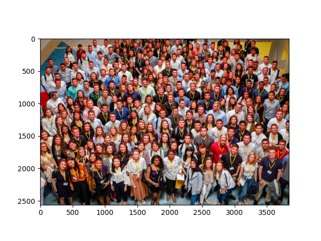

# Face Recognition in 5 lines


In this repository, I built a simple human face recognition with just 5 lines of code. The pretrained model scans an image and find all rectangular areas that contains faces and calculates the number of faces in a given image.

## Installation
Open command prompt and create new environment
```
conda create -n your_env_name python = (any_version_number)
```
Then Activate the newly created environment
```
conda activate your_env_name
```
Clone the repository using `git`
```
git clone https://github.com/Prakashdeveloper03/Face-Recognition-in-5-lines.git
```
Change to the cloned directory
```
cd <directory_name>
```
Then install all requirement packages for the script
```
pip install -r requirements.txt
```
Then, Run the `faceRecognition.py` script
```
python faceRecognition.py
```

#### Input Image:


#### Output Image:
